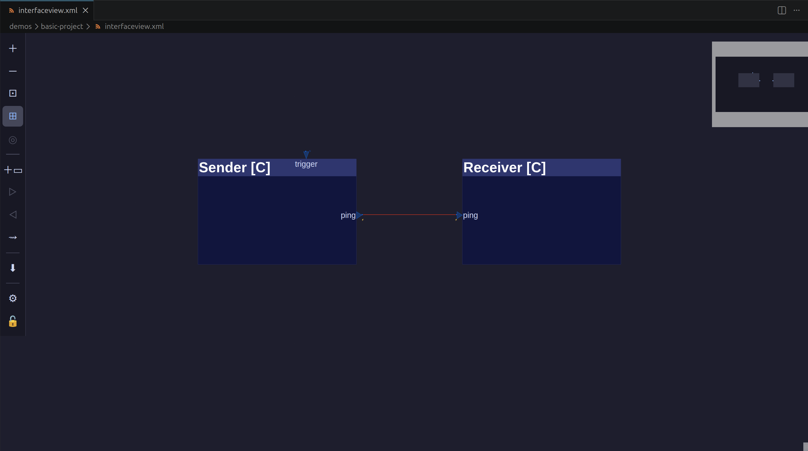
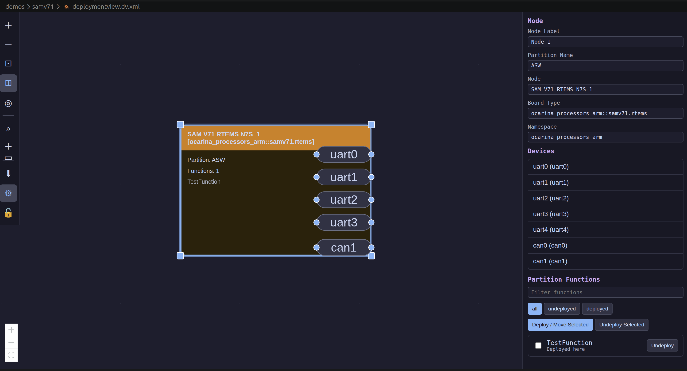
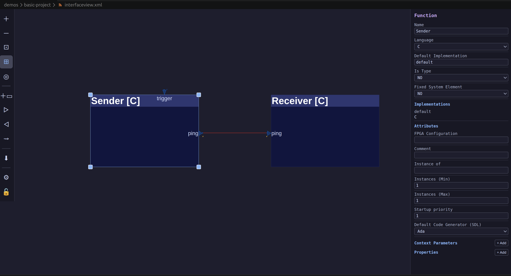
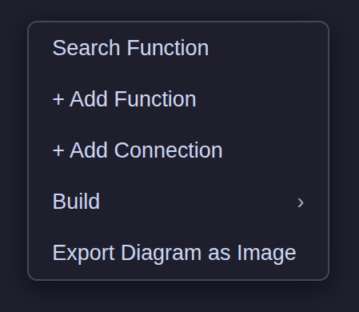

# BEFORE USE

This extension is an entry point into a complex toolchain, and **you may download additional ~30 GB of data by accident**. Read the installation chapter before using the software. This tool is **not a part of TASTE**, and **not affiliated with ESA nor endorsed by ESA**. It is a hobby project.

# General

**VSCIVE** is an extension for [Visual Studio Code](https://code.visualstudio.com/) which provides the capability to:
- view and edit TASTE Interface Views (software logical architecture diagrams),
- view and edit TASTE Deployment Views (software deployment/physical architecture diagrams),
- compile basic projects using TASTE toolchain.

VSCIVE is created as a hobby project and experiment. It does not replace [TASTE](https://taste.tools/) or [SpaceCreator](https://gitlab.esa.int/taste/spacecreator) (the main TASTE Integrated Development Environment), in fact, it uses them under the hood, either directly (if TASTE is installed on the system), or via a docker image (see installation).
The main goals of the project are:
- a lightweight editor for reviewing repositories that include TASTE projects,
- an experiment with LLM-assisted software development,
- an experiment with TypeScript and Visual Studio extension ecosystem,
- a platform for quick iteration of ideas.

The capability to actually build and execute TASTE projects came as an afterthought, mainly due to how easy it was to achieve, given the ESA provided docker image. Due to the nature of the project, it is provided AS-IS, and should be used without any expectations of bugfixes, maintenance or liability (see MIT License).

The tool does not implement all SpaceCreator features, and does not expose all TASTE functionality. In fact, support for nested Functions is limited, while support for Function Types or Time-Space partitioning, as well as integration with OpenGEODE, OPUS2, Spin and many other items is completelly missing. It can be considered a "subset" of TASTE and SpaceCreator capabilities.  

**TASTE**: [TASTE](https://taste.tools/) is a Model Based Software Engineering toolchain developed by ESA, providing facilities to design, simulate, verify and build on-board software. While the mapping is not 1:1, TASTE is semantically compatible with OSRA, and in general, an OSRA architecture can be mapped onto a TASTE architecture.

**OSRA**: [On-Board Software Reference Architecture](https://essr.esa.int/project/osra-onboard-software-reference-architecture) is a reference architecture for designing spacecraft on-board software, produced by ESA in the frame of SAVOIR initiative.

# Capabilities and Usage

Only the most basic usage will be described here. For information regarding general TASTE usage and semantics, refer to the [TASTE main site](taste.tools) and its [wiki](https://gitlab.esa.int/taste/taste-setup/-/wikis/home).

The main use is inspecting existing TASTE projects. Just open interfaceview.xml file, and a visual editor for InterfaceView should open:


Similarly, when opening a *.dv.xml file, a visual editor for Deployment View should open.


The diagrams can be edited, visualisation can be adjusted by opening the options. In particular, the "Focus" command can be usefull for inspecting large systems, as it shows only the nodes connected to the current one, facilitating tracing component interactions. When a Function, Interface, Node or Connection is selected, its properties can be edited. Unlike in SpaceCreator, most options are treated as text strings, without validation, so care should be taken.


New TASTE projects can be created by right clicking on a folder in Explorer and selecting *vscive: taste init here* command, which should create a new project under the selected location, named after the selected directory. This functionality uses standard TASTE commands under the hood.

New Functions can be created either by right clicking on empty space and selecting *New Function* entry, or by selecting *Add Function* from the command palette.


New Interfaces can be created either by right clicking on a Function and selecting *New Provided/Required Interface* entry, or by selecting *Add Connection* from the command palette and clicking the source and target Functions in order.

Before editing implementation code, skeletons need to be created using *Build->Build Skeletons* canvas context menu entry.

When skeletons are built, Function sources can be edited by either navigating to the source using Explorer, or by selecting *Edit* from Function context menu (implemented only for Ada/C/C++ right now).

When all sources are ready, project can be built using *Build->Build Debug/Release* canvas context menu entry and then executed using *Build->Run* (works only for default target).  

# Installation
## General
VSCIVE is intended to be used on Linux, and was tested on Debian 13 and Ubuntu 24.04. Some capabilities may be available on other platforms. 

End users should install the extension by downloading the newest *.vsix package from [Releases](https://github.com/Lurkerpas/vscive/releases).

Developer should install Node and use Makefile targets:
- make test - run tests,
- make package - build project and create vsix package,
- make install - build project and install extension in local Visual Studio Code.

GitHub release automation is configured in `.github/workflows/release-vsix.yml`.
When you push a tag, GitHub Actions will build the extension and attach the generated `*.vsix` file to the GitHub Release for that tag.

## When TASTE is installed on the target system
When TASTE is installed on the host system, standard TASTE commands should work out of the box. All that is left is to configure the editor settings.

When opening an interfaceview.xml file, select options from the command palette and provide a path to the attributes file. Normally, it should be located under ${HOME}/tool-src/misc/space-creator/default_attributes.xml path. Configure other options as you see fit.

When opening a deploymentview.dv.xml file, select options from the command palette and provide a path to the boards file. Normally, it should be located under ${HOME}/tool-src/misc/space-creator/Board1.xml path. Configure other options as you see fit.

## When TASTE is not installed on the target system
When TASTE is not installed on the host system, there are two levels of configuration.

To enable the editor capabilities, configure the extension exactly as if TASTE was installed on the system, however, the respective configuration files should be sourced from [taste-setup](https://gitlab.esa.int/taste/taste-setup/) repository. Download the files locally and set the paths.

To enable project editing and build, you can use docker image kindly provided by ESA:

```
gitlab.esa.int:4567/taste/taste-setup:feature-trixie
```
 
Enter the options (using the editor command palette), check the *Use taste-cli.sh for Commands* option and enter the docker image address. 
If you do not have docker installed, [install it](https://docs.docker.com/engine/install/) and reload Visual Studio Code.
When a build command is issued for the first time, the image will be downloaded. Be aware that it is **~30 GB in size** (at the time of writing of this manual).

Note that the default image contains only basic runtimes and tools. If you want to build projects e.g., for Microchip SAMV71 MCU, you should:
- enter the the container, by invoking *CLI* command (in the *Build* group in editor canvas context menu) or using docker run command,
- (optional) update installation to source the newest code by running *$(HOME)/tool-src/Update-TASTE.sh*
- install the necessary software, e.g., for SAMV71 you should run:
    - *$(HOME)/tool-src/add-ons/install-samx-rtems-runtime.sh*
    - *$(HOME)/tool-src/add-ons/install-rtems-qdp-arm.sh*
- without exiting the container use [docker commit](https://docs.docker.com/reference/cli/docker/container/commit/):
    - *docker ps* to get container ID,
    - *docker commit ID NAME* to save the new image,
    - *docker images* to check the full name of the new image,
- enter the new image name in the editor options as the docker address.

Be aware that doing this will **consume additional gigabytes** of your local storage.

If *Use taste-cli.sh for Commands* is selected, build/run/CLI commands are executed within docker image, with the local folder mounted to the docker. Fewer permissions are used in comparison to the original TASTE [Docker-run.sh](https://gitlab.esa.int/taste/taste-setup/-/blob/feature_trixie/Docker-run.sh?ref_type=heads).


